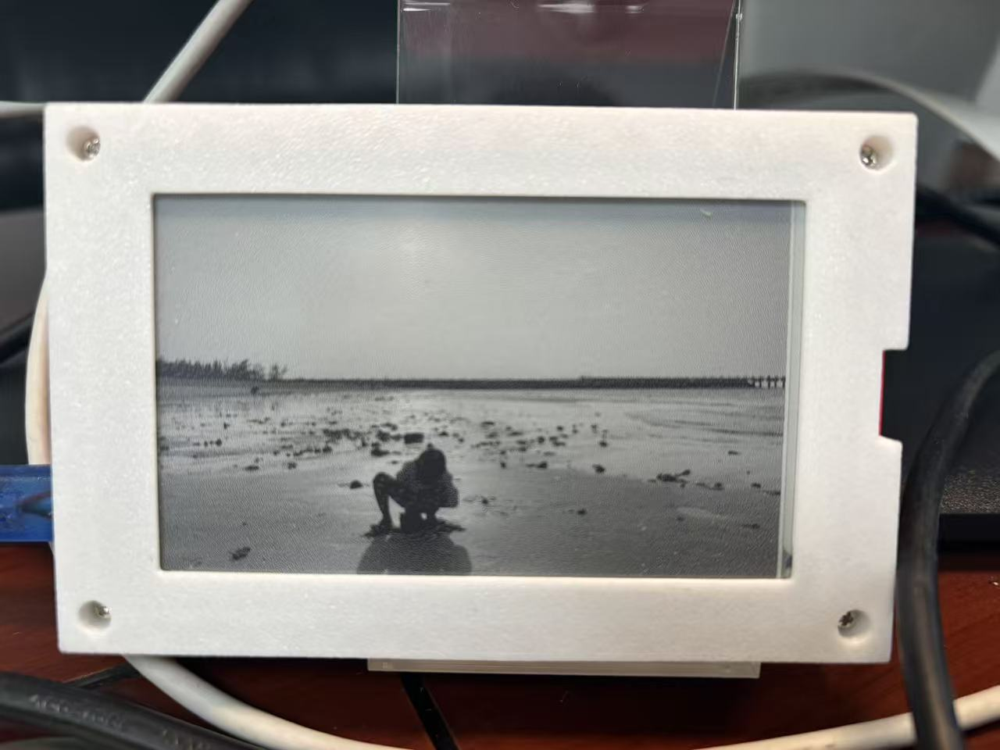
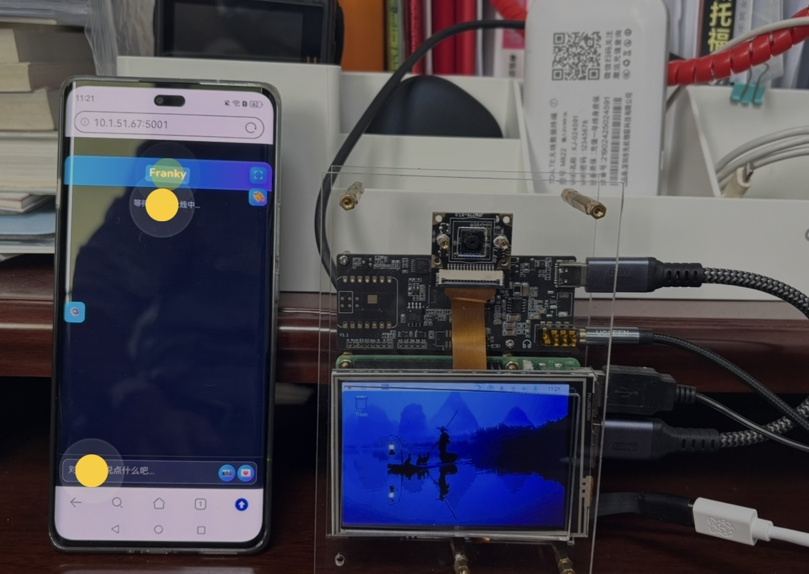
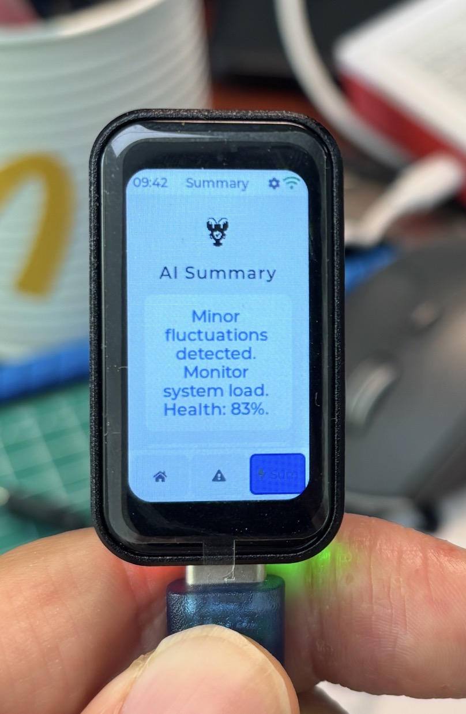
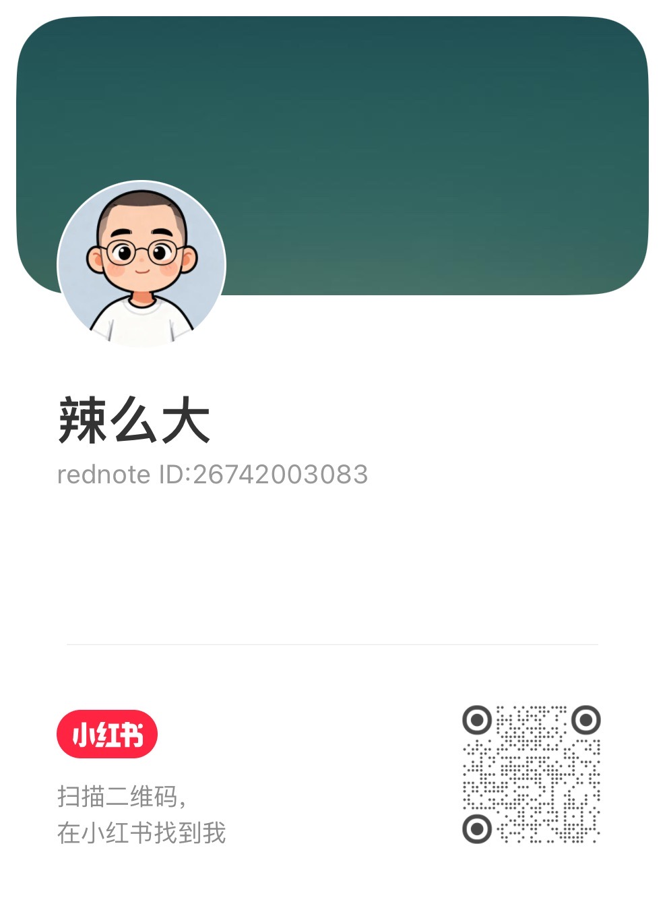

# 一些工作的展示

## 1. 墨水屏相册

孩子两岁半就上托班了，主班老师对他一直很耐心。那段时间他每天都很开心，也留下了不少照片。

后来想着，总得有个方式把这些瞬间留住，就自己做了一个墨水屏电子相册送给老师。把她和孩子们在一起的画面都放进去，平时摆在桌上就能慢慢翻看。

墨水屏看起来比较柔和，希望这个小东西能陪她用很久。

## 2. 讲故事小网站

孩子有一段时间特别喜欢听故事，但每次找内容都很零散，要在不同地方切来切去。

就做了一个小网站，把他常听的都放进去，比如《西游记》和 Pip and Posy。页面很简单，主要是让家里人谁陪他的时候都能用。

https://hudsonstoryteller.netlify.app/

## 3. 智能语音助手Franky

2025年基于树莓派做了一个语音助手，可以通过语音和手机交互，开发的过程发了20几篇技术博客。目前还在自己的办公桌上摆着，定制化了很多自己喜欢的功能。

想着自己能不能做一个语音助手，于是 2025 年用 Raspberry Pi 自己做了一个，起名叫 Franky。

一开始只是想实现简单的语音交互，后来慢慢加了一些自己用得到的功能。过程中边做边记录，陆续写了二十多篇技术博客。

现在这个设备还放在桌子上，有空就继续折腾一点新的东西进去。

博客地址：https://blog.csdn.net/guodong_hu

## 4. EPS32 小实验

2026 年初看到 Claw 相关的东西比较多，就有点好奇：这种东西能不能放到到更轻量的设备上。

于是用 ESP32 做了一些尝试，更多是实验性质，看能跑到什么程度。

还没有完成，但过程挺有意思。

## 5. 多通道召回对话记忆系统（专利）

做语音助手的时候发现已有的方案对于记忆都解决的不是很好，于是设计了一套多通道召回的方式，提升记忆检索的效果，后来整理申请了发明专利，还在申请过程中。

## 其他

平时会在小红书上记录一些做项目的过程，有时候是踩坑，有时候是一些小想法。

